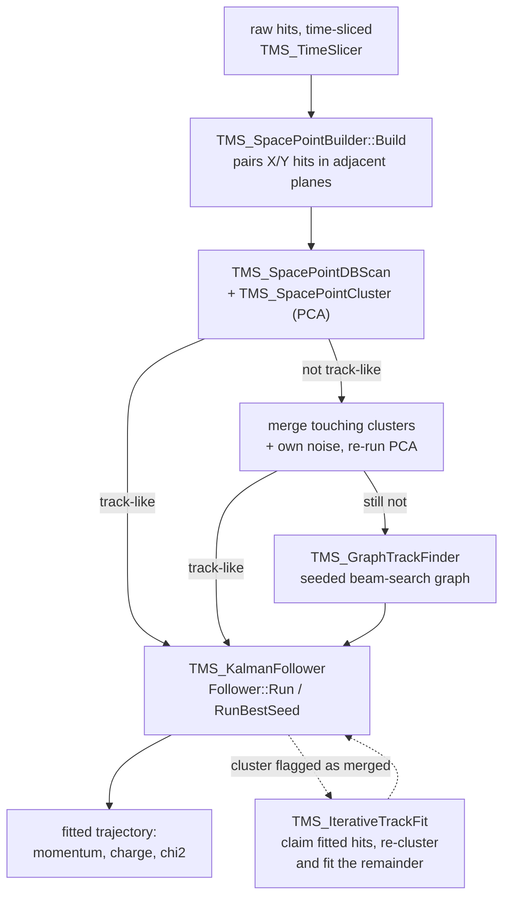

# Cluster3D

A 3D-space-point reconstruction pipeline for the TMS: turn paired X/Y hits
into physics-fit tracks, with real ambiguity resolution at every step. This
is a **fresh, standalone module** developed alongside the legacy
`TMS_TrackFinder`/`TMS_Kalman` pipeline in `src/` — nothing here is wired
into `TMS_Reco.cpp`/`ConvertToTMSTree.cpp` yet. It's exercised today only
through the standalone validation tools in `app/cluster3D/` (see below).

## Pipeline

A space point can carry ambiguity all the way through: one hit may join
several space points (intentional "ghosting", see
`TMS_SpacePointBuilder.h`), a DBSCAN cluster may include several candidates
at the same z-layer, and the Kalman follower is the stage that finally
resolves this via a proper chi2 gate instead of silently keeping one
arbitrary hit. See the interactive pipeline diagram (with legacy-path
comparison, validation numbers, and open issues) for the full picture:
https://claude.ai/code/artifact/2fc47021-a70f-42bf-87b8-5d5c7a9a32c2

## Files

| File | What it does |
|---|---|
| `TMS_SpacePoint.h` | The core data type: an (x, y, z, time) 3D point built from one X-bar hit and one Y-bar hit, carrying both hits' indices so native 2D measurements can be recovered later without rematching. |
| `TMS_SpacePointBuilder.h/.cpp` | Builds space points from an event's (or slice's) hits by pairing X/Y hits in adjacent planes that land within a timing window. One hit can end up in several space points — that combinatorial ambiguity is resolved downstream, not here. |
| `TMS_KDTree.h` | A minimal static 3D KD-tree (build once, radius queries only — no insert/delete/k-NN) used to accelerate `TMS_SpacePointDBScan`'s neighbor lookups. |
| `TMS_SpacePointDBScan.h` | DBSCAN clustering over space points' continuous (x, y, z) positions, with an anisotropic neighbor test (Z tolerance in units of real plane-index gaps, transverse tolerance in units of real bar pitch) — a separate implementation from the legacy `src/TMS_DBScan.h`, which clusters on fragile discretized plane/bar integers instead. |
| `TMS_SpacePointCluster.h` | Wraps a DBSCAN cluster's space-point indices with a 3D PCA (via ROOT's `TMatrixDSym`/`TMatrixDSymEigen`), exposing a linearity score used to classify a cluster as track-like vs. blob/shower-like. |
| `TMS_LayerGrouping.h/.cpp` | Groups space points into z-layers (detector planes) with "first-anchor" tolerance grouping. Shared by `TMS_GraphTrackFinder` and `TMS_KalmanFollower` so both stages agree on exactly where one plane ends and the next begins. |
| `TMS_GraphTrackFinder.h/.cpp` | A bounded, seeded beam-search over a cluster's space points (field-angle-gated links, bar-pitch quantization deadband) that pulls the one straight-ish track out of a genuinely shower-contaminated cluster — DBSCAN+PCA alone has no mechanism for this. Output is ordered space-point indices only, no kinematics. |
| `TMS_FieldModel.h` | A swappable magnetic-field lookup for the Kalman follower's swimmer (`IFieldModel` interface). `ZeroFieldModel` for field-off debugging; `RegionFieldModel` is the current v1 (the same 3-zone piecewise-constant region split as legacy `TMS_Kalman`, field along y, magnitude GDML-confirmed at 1.0T). |
| `TMS_IterativeTrackFit.h/.cpp` | The split step for clusters that merge more than one real particle (e.g. two muons a few bar pitches apart, which PCA still calls track-like). Fits the cluster, claims the X/Y hits of the points the fit chose (removing the ghosts built from them too), re-runs DBSCAN on what is left, and fits the largest track-like piece, repeating up to a cap. Used by `TrackFindingObjectTruth`; not yet part of the muon-first tools' pipeline. |
| `TMS_KalmanFollower.h/.cpp` | The physics fit: re-walks a seed path plane-by-plane, applying real field bending, Bethe-Bloch energy loss, and Lynch-Dahl multiple scattering, and resolving hit ambiguity at each layer via a chi2 gate over every candidate — not just accepting whichever the seed happened to pick. `Follower::Run()` takes an already-ordered seed path (e.g. a `TMS_GraphTrackFinder::Path`); `Follower::RunBestSeed()` is for seeds that *aren't* pre-ordered by a directed search (DBSCAN-direct/merged-PCA clusters) — it tries one hypothesis per candidate at the object's own first z-layer and keeps the best fit, rather than committing to a single naive z-sorted guess. |

## Why a fresh module, not an extension of the legacy code

`src/TMS_Kalman.h/.cpp` (the pipeline actually running in production today,
via `TMS_TrackFinder`) has two gaps that go beyond "unfinished": its
magnetic-field bending term is computed and then never applied, and its hit
selection silently keeps only the last hit per z-layer, with zero ambiguity
resolution. Both are exactly what `TMS_KalmanFollower` exists to fix, so
this is a new module developed in parallel rather than a patch — the legacy
Kalman keeps running as-is until this one is validated at scale and a
promotion decision is made.

## Validation tools (`app/cluster3D/`)

The tools that exercise this module live in `app/cluster3D/`; see
`app/cluster3D/README.md` for what each one does, its command line and its
environment hooks. Their binaries build into `build/app/` like every other
app.

None of them need `TMS_Reco.cpp`: they read space points back out of a
`Reco_Tree` that `ConvertToTMSTree` already wrote. Tools that fit tracks
also need a separate geometry-bearing file, since `TMS_Geom::GetMaterials`'s
material stepping needs a live `TGeoManager` that the standard `Reco_Tree`
file doesn't embed.
