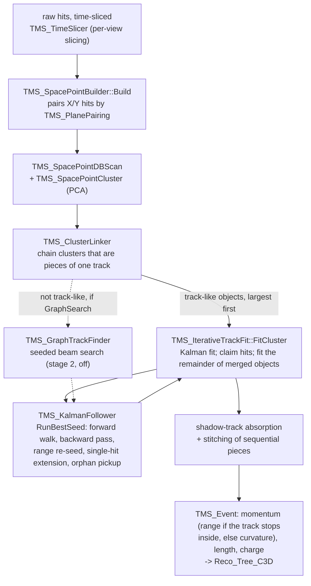

# Cluster3D

A 3D-space-point reconstruction pipeline for the TMS: turn paired X/Y hits
into physics-fit tracks, with real ambiguity resolution at every step. It is
developed alongside the legacy `TMS_TrackFinder`/`TMS_Kalman` pipeline in
`src/` and runs next to it, not instead of it: with `[Recon.Cluster3D]
Enabled = true`, `ConvertToTMSTree` runs it on every time slice
(`TMS_Event::RunCluster3DReco()`) and writes its tracks, in the legacy track
format, to the `Reco_Tree_C3D` / `Truth_Info_C3D` trees next to the legacy
`Reco_Tree` / `Truth_Info`. It is off in the default configuration until it
is validated.

## Pipeline

The orchestration of one slice is `TMS_Cluster3DReco::Run()`; its `Config`
documents every stage's settings and why each default was chosen.

Ambiguity is carried all the way through: one hit may join several space
points (intentional "ghosting", see `TMS_SpacePointBuilder.h`), a cluster may
hold several candidates at the same layer, and the Kalman follower resolves
them with a chi2 gate over every candidate plus the candidate's
light-travel-corrected X/Y hit-time agreement (`TMS_SpacePointTiming`), not by
keeping one arbitrary hit. A track claims its hits as it is accepted, so no
two tracks share one.

What the stages after the fit do, in order:
- **Shadow-track absorption.** A smaller track lying mostly on a bigger
  track's trajectory (at least half its hits within 1.5 bar pitches) is a
  shadow: usually a ghost built from one track's leftover hits in one view
  and foreign hits in the other. Its on-track hits join the bigger track and
  it is dropped.
- **Stitching.** A track that starts where another ends, downstream and
  roughly colinear, is refitted with it as one object. The merged fit
  replaces both only if it reaches the second track's end.

## Settings

All in `config/TMS_Default_Config.toml`, read with defaults where noted.

| Section / key | What it sets |
|---|---|
| `[Recon.Cluster3D] Enabled` | Run Cluster3D in conversion at all (off by default). |
| `LinkClusters` | Chain DBSCAN clusters into one object before fitting (`TMS_ClusterLinker`). |
| `GraphSearch` | Stage 2: graph search in non-track-like clusters (off: few muons, many fakes). |
| `MomentumFromRange`, `RangeContainmentMarginXY/Z` | Report range momentum for tracks that end at least the margins inside the bar region, the curvature fit's otherwise. |
| `RangeReseedFactor` | Re-walk each track seeded at this factor times its range momentum, keeping the fit if it reaches further (0 = off). |
| `XYTimeSigmaNs`, `XYTimeGateNSigma` | Width of the X/Y hit-time term in the follower's candidate choice, and the gate (in sigmas) beyond which a candidate is rejected. |
| `[Recon.SpacePoints] Pairing`, `PairingFallback`, `TimingWindow` | Which planes' hits are paired into points, and the X/Y time window. |
| `[Recon.Time] PerViewSlicing` and `PerView*` | Per-view time slicing (`TMS_TimeSlicer`), which keeps a muon's two views in one slice despite the light's travel time along the bars. |

## Files

| File | What it does |
|---|---|
| `TMS_Cluster3DReco.h/.cpp` | The production entry point: one slice's space points and hits in, fitted tracks out (DBSCAN, linking, fitting and splitting, stage 2, shadow absorption, stitching). `BuildFitHits()` turns the slice's hits into the follower's 1D measurements. |
| `TMS_SpacePoint.h` | The core data type: an (x, y, z, time) 3D point built from one X-bar hit and one Y-bar hit, carrying both hits' indices so native 2D measurements can be recovered later without rematching. |
| `TMS_PlanePairing.h/.cpp` | Which planes' hits are paired, derived from the geometry's plane list and orientations. `NearestY` (default since 2026-09-25): each x-measuring (Y-bar) plane with its nearest y-measuring (X-bar) plane, front-section ties downstream, point z at the pair's midpoint, one point layer per pair, plus fallback pairs for hits left unpaired. `BothNeighbors`: the original adjacent-planes scheme, kept only until `NearestY` is validated. Set by `[Recon.SpacePoints] Pairing`. |
| `TMS_SpacePointBuilder.h/.cpp` | Builds space points from an event's (or slice's) hits by pairing X/Y hits from the planes `TMS_PlanePairing` pairs, within a timing window; each point carries its point layer. One hit can end up in several space points — that combinatorial ambiguity is resolved downstream, not here. |
| `TMS_SpacePointTiming.h/.cpp` | The light-travel ("transit") correction of a space point's two hit times: each hit's light travels along its bar to the readout, and the point gives the position along each bar. After the correction a genuine point's tX − tY is centered on zero within a few ns (3.7 ns MAD-sigma over all points; tracks' chosen points are tighter still), while a ghost pairing hits from different interactions keeps their real time difference. |
| `TMS_KDTree.h` | A minimal static 3D KD-tree (build once, radius queries only — no insert/delete/k-NN) used to accelerate `TMS_SpacePointDBScan`'s neighbor lookups. |
| `TMS_SpacePointDBScan.h` | DBSCAN clustering over space points' continuous (x, y, z) positions, with an anisotropic neighbor test (a z window in mm, and a transverse allowance of one bar pitch plus a maximum slope times the z distance) — a separate implementation from the legacy `src/TMS_DBScan.h`, which clusters on fragile discretized plane/bar integers instead. |
| `TMS_SpacePointCluster.h` | Wraps a DBSCAN cluster's space-point indices with a 3D PCA (via ROOT's `TMatrixDSym`/`TMatrixDSymEigen`), exposing a linearity score used to classify a cluster as track-like vs. blob/shower-like. |
| `TMS_ClusterLinker.h/.cpp` | Links DBSCAN clusters that are pieces of one track before anything is fitted: ordered in z, colinear across the gap, same time, at most one link each way per cluster. A cluster spanning the whole muon gives the follower the right momentum seed and one fit (one momentum, one charge) instead of several fragments. |
| `TMS_LayerGrouping.h/.cpp` | Groups space points by their point layer (z tolerance only for points without one, e.g. older files). Shared by `TMS_GraphTrackFinder` and `TMS_KalmanFollower` so both stages agree on exactly where one layer ends and the next begins. Gap limits in both are z distances in mm. |
| `TMS_GraphTrackFinder.h/.cpp` | A bounded, seeded beam-search over a cluster's space points (field-angle-gated links, bar-pitch quantization deadband) that pulls the one straight-ish track out of a genuinely shower-contaminated cluster — DBSCAN+PCA alone has no mechanism for this. Output is ordered space-point indices only, no kinematics. Used as stage 2 when `GraphSearch` is on. |
| `TMS_FieldModel.h` | A swappable magnetic-field lookup for the Kalman follower's swimmer (`IFieldModel` interface). `ZeroFieldModel` for field-off debugging; `RegionFieldModel` is the current model: field along y, in the steel only (as the GDML has it), 1.0 T, with the sign flip at \|x\| = 1860 mm measured from Geant4 truth. |
| `TMS_IterativeTrackFit.h/.cpp` | Fits one object and handles objects that merge more than one real particle (e.g. two muons a few bar pitches apart, which PCA still calls track-like): fits it, claims the X/Y hits of the points the fit chose (removing the ghosts built from them too), re-runs DBSCAN on what is left, and fits the largest track-like piece, repeating up to a cap. Stage 1 of `TMS_Cluster3DReco`. |
| `TMS_KalmanFollower.h/.cpp` | The physics fit: re-walks a seed path plane by plane, applying field bending, Bethe-Bloch energy loss and Lynch-Dahl multiple scattering, and resolving hit ambiguity at each layer over every candidate (position chi2 plus the X/Y time term, with candidates beyond `XYTimeGateNSigma` rejected unless the mismatch looks like a bar shared with an earlier particle (`XYTimeGateNeedsAlternative`)). Updates hit by hit (`Measurement = Hits`: each hit is a 1D measurement at its own plane). `RunBestSeed()` tries one hypothesis per candidate at the object's first layer and keeps the best fit. After the forward walk: a backward pass from the last measurement for the start momentum; a re-walk seeded from the track's range momentum if that reaches further; a single-hit extension past the last point; and pickup of orphan hits (hits in no space point) near the trajectory. The range walk behind `RangeMomentumMeV` takes its energy loss from each material's range-energy table, exact for any step length (`RangeTableRangeMomentum`), with the stopping power scaled by `RangeTableStoppingPowerScale` = 0.98 to match Geant4; the tracking steps keep the one-point dE/dx estimate (`RangeTableEnergyLoss` off: the tables there moved where the forward walk ranges out, and cost correctly ended tracks). `RangeMomentumMeV` is the momentum needed to cross the material between the first and last hit (`TMS_Geom::GetMaterials`) and then stop halfway through the unseen material before the next scintillator layer (`ExpectedStopRange`). |

## Why a fresh module, not an extension of the legacy code

`src/TMS_Kalman.h/.cpp` (the pipeline actually running in production today,
via `TMS_TrackFinder`) has two gaps that go beyond "unfinished": its
magnetic-field bending term is computed and then never applied, and its hit
selection silently keeps only the last hit per z-layer, with zero ambiguity
resolution. Its reported momentum is a range momentum, walked backward from
the track's end with energy loss added. The measurements never update it.
Both gaps are exactly what `TMS_KalmanFollower` exists to fix, so this is a
new module developed in parallel rather than a patch — the legacy Kalman
keeps running as-is until this one is validated at scale and a promotion
decision is made.

## Validation

- **In conversion.** With `Enabled = true`, the validation suite
  (`scripts/Validation/Tracking_Validation`) reads the Cluster3D trees when
  run with `TMS_VALIDATION_RECO_TREE=Reco_Tree_C3D
  TMS_VALIDATION_TRUTH_TREE=Truth_Info_C3D`, so both trackers get the same
  plots from the same files.
- **Truth tools** in `app/cluster3D/`: see `app/cluster3D/README.md` for what
  each does, its command line and its environment hooks.
  `Cluster3DRecoTruth` runs exactly the production stage and scores every
  track and every true muon. Their binaries build into `build/app/` like
  every other app. They read space points back out of a `Reco_Tree` that
  `ConvertToTMSTree` already wrote, and tools that fit tracks also need a
  separate geometry-bearing file (the input `*.EDEPSIM_SPILLS.root`), since
  `TMS_Geom::GetMaterials`'s material stepping needs a live `TGeoManager`
  that the standard `Reco_Tree` file doesn't embed.

An interactive diagram of an earlier stage of the pipeline (before cluster
linking, stitching and per-view slicing), with a legacy-path comparison:
https://claude.ai/code/artifact/2fc47021-a70f-42bf-87b8-5d5c7a9a32c2
